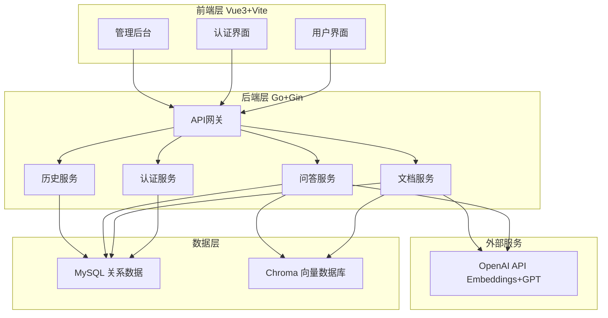
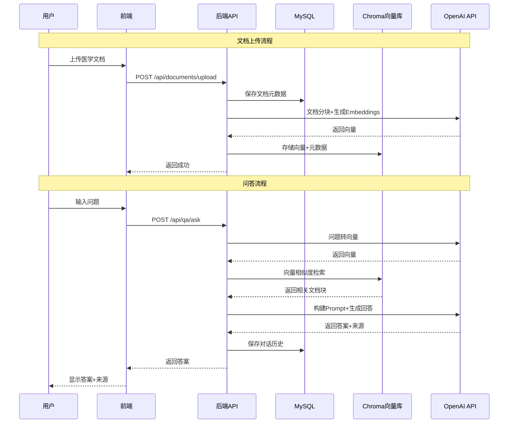

## 医学问答助手项目文档

### 项目概述

基于检索增强生成（RAG）技术的医学问答助手，通过向量检索和生成式 AI 结合，为用户提供准确、可追溯的医学知识问答服务。

### 核心功能

1. **用户认证与授权**：用户注册、登录、权限管理
2. **医学文档管理**：文档上传、解析、向量化存储
3. **智能问答**：基于 RAG 的医学问题回答，支持来源引用
4. **对话历史**：保存和管理用户对话记录
5. **管理后台**：文档管理、用户管理、系统配置

### 技术架构

#### 系统架构图



#### 数据流程



### 技术栈详解

#### 后端技术栈

- **Go 1.21+**：高性能后端语言
- **Gin**：轻量级 Web 框架，提供路由、中间件支持
- **Gorm**：ORM 框架，简化数据库操作
- **MySQL**：存储用户数据、文档元数据、对话历史
- **Chroma**：云端向量数据库，存储文档嵌入向量
- **OpenAI API**：
  - `text-embedding-ada-002`：文档和问题向量化
  - `gpt-3.5-turbo` / `gpt-4`：生成答案

#### 前端技术栈

- **Vue 3**：渐进式前端框架
- **Vite**：快速构建工具
- **Vue Router**：路由管理
- **Pinia**：状态管理
- **Axios**：HTTP 客户端
- **Element Plus / Ant Design Vue**：UI 组件库（可选）

### 实现方案

#### 后端架构设计

```text
backend/
├── cmd/
│   └── server/
│       └── main.go           # Application entrypoint
├── internal/
│   ├── config/               # Configuration management
│   ├── models/               # Data models (Gorm)
│   ├── handlers/             # HTTP handlers
│   ├── services/             # Business logic layer
│   │   ├── auth.go
│   │   ├── document.go
│   │   ├── qa.go
│   │   └── history.go
│   ├── repositories/         # Data access layer
│   ├── middleware/           # Middleware (auth, logging, etc.)
│   └── utils/                # Utility functions
├── pkg/
│   ├── openai/               # OpenAI client wrapper
│   ├── chroma/               # Chroma client wrapper
│   └── vector/               # Vector processing helpers
├── api/
│   └── routes.go             # Route definitions
├── migrations/               # Database migration files
└── go.mod
```

#### 前端架构设计

```text
frontend/
├── src/
│   ├── main.js              # Entry file
│   ├── App.vue              # Root component
│   ├── router/              # Router configuration
│   ├── stores/              # Pinia stores
│   ├── views/               # Page components
│   │   ├── Login.vue
│   │   ├── Register.vue
│   │   ├── Chat.vue
│   │   ├── Documents.vue
│   │   └── Admin.vue
│   ├── components/          # Shared components
│   ├── api/                 # API client wrappers
│   ├── utils/               # Utility functions
│   └── assets/              # Static assets
├── public/
└── package.json
```

#### 核心实现要点

1. **文档处理流程**：

   - 文档上传 → PDF/TXT 解析 → 文本分块（chunking）→ OpenAI Embeddings → 存储到 Chroma
   - 分块策略：按段落或固定 token 数（如 500 tokens），保留重叠窗口

2. **RAG 检索流程**：

   - 用户问题 → OpenAI Embeddings → Chroma 相似度检索（top-k=5）→ 构建上下文 → GPT 生成答案

3. **来源引用**：

   - Chroma 返回的文档块包含元数据（文档ID、页码、段落位置）
   - GPT 生成答案时要求标注来源
   - 前端展示答案时高亮显示引用来源

4. **认证授权**：

   - JWT Token 认证
   - 角色：普通用户、管理员
   - 中间件保护 API 路由

### 数据库设计

#### MySQL 表结构

- `users`：用户表（id, username, email, password_hash, role, created_at）
- `documents`：文档表（id, user_id, filename, file_path, status, created_at）
- `chat_sessions`：对话会话表（id, user_id, title, created_at）
- `chat_messages`：消息表（id, session_id, role, content, sources, created_at）

#### Chroma 集合结构

- Collection: `medical_documents`
- Metadata: `document_id`, `chunk_index`, `page_number`, `source_file`

### 部署方案

- **开发环境**：本地运行，使用环境变量配置（如 OpenAI Key、数据库连接、Chroma 地址等）
- **生产环境**：推荐使用 Docker 容器化部署，并通过 Nginx 进行反向代理和静态资源托管

